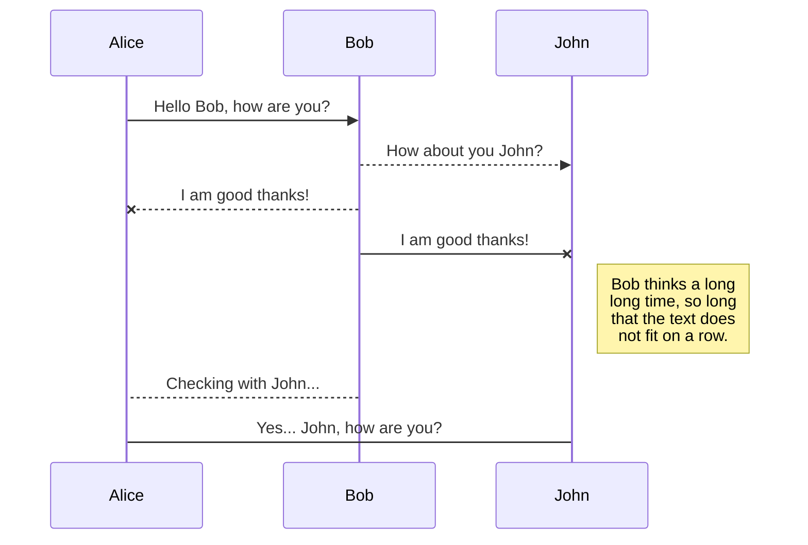
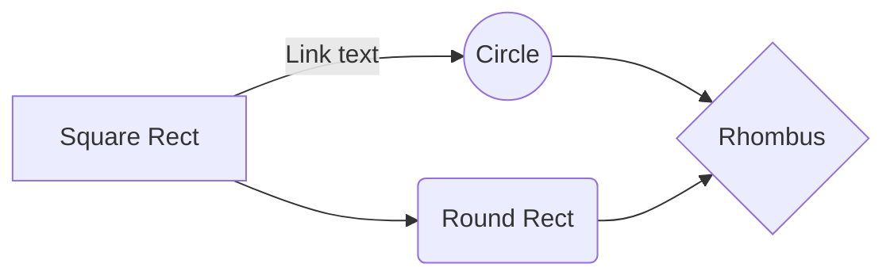

# Información de cómo proceder


## Templates

- emirodgar_post


## Cabecera

---
title: 
description: 
image: https://emirodgar.com/cdn/images/og/auditoria.png
layout: emirodgar_post
author: Emirodgar
sitemap: 1
feed: 1
folder: seo
lang: es_ES
permalink: 

### Opcionales

toc: 1  - para que aparezca la tabla de contenidos
sitemap: 1 - para incluir en Sitemap XML
feed: 1 - para incluir en feed RSS
tags: 1 (home), 2 (), 3() 

### Imágenes OG

https://emirodgar.com/cdn/images/og/analitica.png
https://emirodgar.com/cdn/images/og/auditoria.png
https://emirodgar.com/cdn/images/og/estrategia-seo.png

---

## Incluir imágenes

```
{:class="img-responsive"}
```


## SmartyPants

SmartyPants converts ASCII punctuation characters into "smart" typographic punctuation HTML entities. For example:

|                |ASCII                          |HTML                         |
|----------------|-------------------------------|-----------------------------|
|Single backticks|`'Isn't this fun?'`            |'Isn't this fun?'            |
|Quotes          |`"Isn't this fun?"`            |"Isn't this fun?"            |
|Dashes          |`-- is en-dash, --- is em-dash`|-- is en-dash, --- is em-dash|


## KaTeX

You can render LaTeX mathematical expressions using [KaTeX](https://khan.github.io/KaTeX/):

The *Gamma function* satisfying $\Gamma(n) = (n-1)!\quad\forall n\in\mathbb N$ is via the Euler integral

$$
\Gamma(z) = \int_0^\infty t^{z-1}e^{-t}dt\,.
$$

> You can find more information about **LaTeX** mathematical expressions [here](http://meta.math.stackexchange.com/questions/5020/mathjax-basic-tutorial-and-quick-reference).


## UML diagrams

You can render UML diagrams using [Mermaid](https://mermaidjs.github.io/). For example, this will produce a sequence diagram:



And this will produce a flow chart:


<!--stackedit_data:
eyJoaXN0b3J5IjpbMTM1Nzg3NjgyNl19
-->